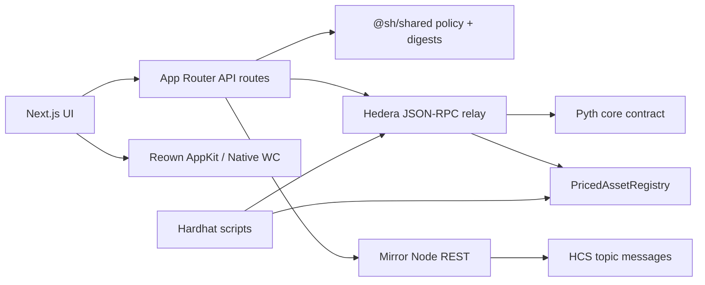

# Priced Asset Registry

Oracle-stamped HTS asset registry template for [Scaffold-HBAR](https://github.com/hedera-dev/scaffold-hbar).

Bind an issuance claim (“these units of this HTS token were priced now”) to a **Pyth** observation, commit a **keccak256** attestation digest, and independently verify the envelope against **Mirror Node** (and, when deployed, the on-chain `PricedAssetRegistry` contract).

| | |
| --- | --- |
| **Status** | Working scaffold — contracts, shared policy/digest math, Mirror verification, and wallets are implemented. End-to-end HCS publish + registry write from `/api/attest` is **not** fully wired yet (see [Current limitations](#current-limitations)). |
| **Bounty role** | External Scaffold-HBAR template (monorepo + `template.json` + MIT). |
| **Default network** | Hedera **testnet** |
| **License** | [MIT](./LICENSE) |

Scaffold with the CLI (replace with your public GitHub `owner/repo`):

```bash
npm create scaffold-hbar@latest -- --template owner/repo
```

Or clone this repository and follow [Getting started](./docs/getting-started.md).

Full documentation index: [docs/index.md](./docs/index.md).

---

## What problem this solves

An issuance claim is only as trustworthy as the process that produced it. This template shows a Hedera-native pattern where:

1. A **Pyth** price observation is read through the Hedera JSON-RPC relay.
2. Off-chain policy (freshness / deviation) matches the Solidity checks in `PricedAssetRegistry`.
3. A **canonical JSON** envelope is hashed with keccak256 — that digest is what the contract stores.
4. **Mirror Node** is used to re-fetch HCS payloads and prove the digest still matches.

Intended audience: Hedera developers who need an oracle + attestation + verification starting point, not a finished production custody system.

---

## Features (implemented)

| Feature | Hedera / ecosystem surface | Where it lives |
| --- | --- | --- |
| Pyth price reads (read-only on Hedera today) | JSON-RPC → Pyth core | `packages/shared` oracle constants; `packages/nextjs/services/oracle.ts`; Hardhat `oracle:read` |
| Policy evaluation (age + deviation) | Shared TS + Solidity | `packages/shared/src/utils/oraclePolicy.ts`; `PricedAssetRegistry.sol` |
| Canonical attestation digest | keccak256 over sorted JSON | `packages/shared/src/utils/attestation.ts` |
| On-chain registry | HSCS / EVM | `packages/hardhat/contracts/PricedAssetRegistry.sol` |
| Mirror Node verification | Mirror REST | `packages/nextjs/services/mirror.ts`, `attestation.ts`; `POST /api/verify` |
| Dual wallets | Reown AppKit (EVM) + native Hedera WalletConnect | `packages/nextjs/lib/reown.ts`, `nativeHedera.ts`, `components/wallet/` |
| Network matrix | testnet / mainnet / previewnet / localnode | `@sh/shared` + `packages/nextjs/lib/networks.ts` |

---

## Architecture overview



Packages:

| Package | Role |
| --- | --- |
| `packages/shared` (`@sh/shared`) | Network endpoints, Pyth deployments, env resolution, attestation digests, policy math, ABI |
| `packages/hardhat` (`@sh/hardhat`) | Solidity registry, mock oracle, deploy/read/verify scripts, contract tests |
| `packages/nextjs` (`@sh/nextjs`) | App Router UI, wallet providers, server services, API routes |

Details: [docs/architecture.md](./docs/architecture.md).

---

## Technology stack

| Layer | Choice | Notes |
| --- | --- | --- |
| Runtime | Node.js **≥ 20.18.3** (CI uses **22.15.0**) | Matches Scaffold-HBAR / bounty gate |
| Package manager | **Yarn 4.9.2** (Berry) | npm/pnpm are not supported for this monorepo |
| Frontend | Next.js **15.5.x**, React 19, Tailwind CSS 4 | App Router |
| Wallets | `@reown/appkit` + `wagmi` / `viem`; `@hashgraph/hedera-wallet-connect` | EVM vs native paths |
| Contracts | Hardhat **2.29**, Solidity **0.8.28**, ethers v6 | Hedera JSON-RPC networks |
| Shared lib | TypeScript strict, Vitest (shared + nextjs), Mocha/Chai (hardhat) | |

---

## Prerequisites

**Required**

- Node.js ≥ 20.18.3
- Git
- Yarn 4 via Corepack: `corepack enable && corepack prepare yarn@4.9.2 --activate`
- A funded Hedera **testnet** account for deploys ([portal faucet](https://portal.hedera.com/faucet))

**Optional**

- [Reown Cloud](https://cloud.reown.com) project ID (a fallback ID exists for local smoke tests; use your own for anything shared)
- Browser wallets: MetaMask / WalletConnect-compatible (EVM) and/or HashPack / Blade / Kabila (native Hedera WC)

---

## Installation and setup

```bash
# From a clone
yarn install          # also builds @sh/shared (postinstall)

cp .env.example .env  # then fill operator + public registry vars
# Frontend-only overrides may also live in packages/nextjs/.env.local

yarn hardhat:account:generate   # or yarn hardhat:account:import
# Fund the printed account on testnet

yarn hardhat:compile
yarn hardhat:test
yarn hardhat:deploy             # Hedera testnet → writes .deploy/ and prints address

# Point the app at the deployment
# NEXT_PUBLIC_REGISTRY_ADDRESS=0x…  (and optional HEDERA_ATTESTATION_TOPIC_ID)

yarn next:dev                   # http://localhost:3000
```

Expected outcomes:

- `yarn install` completes and `packages/shared/dist` exists.
- `yarn hardhat:deploy` prints a registry address and HashScan link.
- `yarn next:dev` serves `/`, `/issue`, `/verify`, and `/docs`.

More detail: [docs/getting-started.md](./docs/getting-started.md).

---

## Configuration

Canonical names live in `packages/shared/src/constants/registry.ts` (`ENV_KEYS`). See [docs/configuration.md](./docs/configuration.md) and [`.env.example`](./.env.example).

| Variable | Required | Side | Purpose |
| --- | --- | --- | --- |
| `HEDERA_OPERATOR_ACCOUNT_ID` | For deploy / operator writes | Server | Operator account `0.0.x` |
| `HEDERA_OPERATOR_PRIVATE_KEY` | For deploy / operator writes | Server | Raw `0x` + 64 hex secp256k1 (not DER) |
| `HEDERA_NETWORK` | No (default `testnet`) | Both | `testnet` \| `mainnet` \| `previewnet` \| `localnode` |
| `HEDERA_JSON_RPC_URL` | No | Server | Override Hashio relay |
| `HEDERA_MIRROR_NODE_URL` | No | Server | Override Mirror base URL |
| `PYTH_ORACLE_ADDRESS` | No | Server | Override known Pyth core address |
| `NEXT_PUBLIC_ORACLE_FEED_ID` | No | Public | Default HBAR/USD feed id |
| `NEXT_PUBLIC_REGISTRY_ADDRESS` | For live registry reads/writes | Public | Deployed registry `0x…` |
| `NEXT_PUBLIC_REGISTRY_CONTRACT_ID` | No | Public | Hedera entity id `0.0.x` |
| `HEDERA_ATTESTATION_TOPIC_ID` | For HCS verification path | Both* | Topic `0.0.x` |
| `REGISTRY_MAX_PRICE_AGE_SECONDS` | No | Server | Freshness bound (default 7776000) |
| `REGISTRY_MAX_DEVIATION_BPS` | No | Server | Max deviation (default 50) |
| `NEXT_PUBLIC_REOWN_PROJECT_ID` | Recommended | Public | Reown / WalletConnect project id |

\*Browser-safe allowlist may expose topic id via `/api/config`; never put the operator key in `NEXT_PUBLIC_*`.

---

## Wallet connectivity

Two parallel connection modes (see [docs/wallet-connectivity.md](./docs/wallet-connectivity.md)):

1. **Reown AppKit (EVM)** — `WagmiAdapter` for Hedera testnet/mainnet chain ids **296 / 295**. Used for EVM contract interaction patterns.
2. **Native Hedera WalletConnect** — `@hashgraph/hedera-wallet-connect` `DAppConnector` for HashPack / Blade / Kabila-style sessions.

Unified React access: `useWallet()` from `packages/nextjs/hooks/useWallet.ts`.

Connecting a wallet is **not** the same as completing an on-chain issuance: signing and broadcasting for the issue flow still depend on the attest API / contract write path (see limitations).

---

## Hedera network support

| Network | Chain ID | JSON-RPC (default) | Mirror (default) | Explorer |
| --- | --- | --- | --- | --- |
| testnet | 296 | `https://testnet.hashio.io/api` | `https://testnet.mirrornode.hedera.com` | https://hashscan.io/testnet |
| mainnet | 295 | `https://mainnet.hashio.io/api` | `https://mainnet.mirrornode.hedera.com` | https://hashscan.io/mainnet |
| previewnet | 297 | previewnet Hashio | previewnet Mirror | https://hashscan.io/previewnet |
| localnode | 31337 | `http://127.0.0.1:8545` | `http://127.0.0.1:5600` | local |

Source of truth: `packages/shared/src/constants/networks.ts`.

**EVM vs native:** JSON-RPC + Solidity for Pyth and `PricedAssetRegistry`; Mirror REST + (planned) native SDK for HCS topic payloads. UI selectable networks are **testnet** and **mainnet**; previewnet/localnode are infrastructure/dev.

---

## Main workflows

### 1. Deploy registry (testnet)

```bash
yarn hardhat:deploy
```

Sets up `PricedAssetRegistry` against the known Pyth address (or `PYTH_ORACLE_ADDRESS`). Output → console + `.deploy/`.

### 2. Read oracle

```bash
yarn hardhat:oracle:read
# or open the app dashboard / GET /api/oracle
```

### 3. Verify an attestation digest

```bash
# UI: /verify
# API: POST /api/verify  { "digest": "0x…", "topicId": "0.0.x" }
```

Uses Mirror Node + optional on-chain record comparison (`packages/nextjs/services/attestation.ts`).

### 4. Issue / attest (current behavior)

`POST /api/attest` reads Pyth, runs policy checks, and computes a digest — but **returns a synthetic `transactionHash`**. It does not yet submit HCS or call `recordIssuance`. Treat the UI issue flow as a **preview** until that path is completed. See [docs/transaction-lifecycle.md](./docs/transaction-lifecycle.md).

---

## Testing

```bash
yarn test              # shared (vitest) + nextjs (vitest) + hardhat (mocha)
yarn check-types
yarn lint
yarn format:check
yarn build             # next production build (shared already built on install)
yarn verify            # format:check + lint + check-types + test + build
```

Do not assume CI green without running these locally. Manual testnet proof for bounty submission must include a real HashScan / Mirror link from a transaction you broadcast.

---

## Deployment

| Target | How |
| --- | --- |
| Local dry-run registry | `yarn hardhat:deploy:local` (mock oracle) |
| Hedera testnet registry | `yarn hardhat:deploy` |
| Hedera mainnet registry | `yarn hardhat:deploy:mainnet` (real value — use with care) |
| Frontend | Deploy `packages/nextjs` as a Next.js app; set env vars in the host; never ship operator keys |

Details: [docs/deployment.md](./docs/deployment.md).

---

## Security

- Operator keys are **server-only** (`SERVER_ONLY_ENV_KEYS`); `/api/config` uses an allowlist (`toBrowserEnvironment`).
- Prefer `yarn hardhat:account:generate` keys (`0x` + 64 hex). DER keys from some portal exports are rejected by `assertUsablePrivateKey`.
- Mainnet is never the implicit default.
- Contracts and template code are **not audited**.
- Pyth on Hedera is **read-only** in this template (Hermes update path not usable for Hedera feeds at last verification).

See [docs/security.md](./docs/security.md).

---

## Current limitations

Documented honestly for bounty reviewers and adopters:

1. **`/api/attest` does not broadcast** — mock `transactionHash` only after policy + digest.
2. **No HTS `TokenCreate`** — registry references existing HTS tokens; it does not mint them.
3. **Pyth read-only** — prices come from the last on-chain update; wide default `REGISTRY_MAX_PRICE_AGE_SECONDS` exists so demos are possible when feeds are stale (tighten for production).
4. **Issuance UI** may present steps that exceed what `/api/attest` currently performs.

---

## Troubleshooting

See [docs/troubleshooting.md](./docs/troubleshooting.md) for Reown project ID, network mismatch, missing registry address, DER key errors, and module-resolution issues with `viem` / optional wallet peers.

---

## Extending the template

| Goal | Start here |
| --- | --- |
| Add a Hedera service | [docs/guides/add-a-hedera-service.md](./docs/guides/add-a-hedera-service.md) |
| Add a wallet provider | [docs/guides/add-a-wallet-provider.md](./docs/guides/add-a-wallet-provider.md) |
| Add a network | [docs/guides/add-a-network.md](./docs/guides/add-a-network.md) |
| Finish / change the write path | [docs/guides/implement-a-transaction.md](./docs/guides/implement-a-transaction.md) |

AI coding agents: read [AGENTS.md](./AGENTS.md).

---

## Scaffold-HBAR template metadata

- Manifest: [`template.json`](./template.json) (`create-scaffold-hbar` capabilities, env, outro)
- Monorepo packages: `shared`, `hardhat`, `nextjs`
- Required bounty artifacts present: `README.md`, `AGENTS.md`, `template.json`, MIT `LICENSE`

Eligibility still requires a clean scaffold, lint/build, and a **verifiable testnet transaction** you produce and link — documentation alone does not satisfy the gate.

---

## Contribution and license

Contribution guide: [docs/contributing.md](./docs/contributing.md).

Licensed under the [MIT License](./LICENSE).
