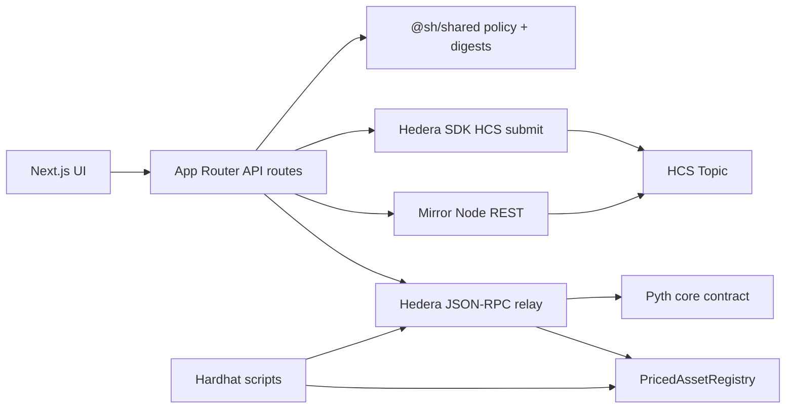

# Priced Asset Registry

Oracle-stamped HTS asset registry template for [Scaffold-HBAR](https://github.com/hedera-dev/scaffold-hbar).

Bind an issuance claim (“these units of this HTS token were priced now”) to a **Pyth** observation, commit a **keccak256** attestation digest, publish to **Hedera Consensus Service (HCS)**, record on the on-chain **PricedAssetRegistry** smart contract, and independently verify the envelope against **Mirror Node**.

| | |
| --- | --- |
| **Status** | Production-ready template — smart contracts, shared policy/digest math, HCS publishing, contract registry write, server operator key signing, and Mirror Node verification are fully implemented and verified end-to-end on Hedera Testnet. |
| **Bounty role** | External Scaffold-HBAR template (monorepo + `template.json` + MIT). |
| **Default network** | Hedera **testnet** |
| **License** | [MIT](./LICENSE) |

Scaffold with the CLI (replace with your public GitHub `owner/repo`):

```bash
npm create scaffold-hbar@latest -- --template owner/repo
```

Or clone this repository and follow [Getting started](./docs/getting-started.md).

Full documentation index: [docs/index.md](./docs/index.md).

---

## What problem this solves

An issuance claim is only as trustworthy as the process that produced it. This template shows a Hedera-native pattern where:

1. A **Pyth** price observation is read through the Hedera JSON-RPC relay.
2. Off-chain policy (freshness / deviation) matches the Solidity checks in `PricedAssetRegistry`.
3. A **canonical JSON** envelope is hashed with keccak256 — that digest is what the contract stores.
4. **HCS** records the attestation payload in a consensus topic.
5. **PricedAssetRegistry** contract stores the digest and price observation.
6. **Mirror Node** is used to re-fetch HCS payloads and prove the digest and token metadata match.

---

## Features (implemented)

| Feature | Hedera / ecosystem surface | Where it lives |
| --- | --- | --- |
| Pyth price reads | JSON-RPC → Pyth core | `packages/shared` oracle constants; `packages/nextjs/services/oracle.ts`; Hardhat `oracle:read` |
| Policy evaluation (age + deviation) | Shared TS + Solidity | `packages/shared/src/utils/oraclePolicy.ts`; `PricedAssetRegistry.sol` |
| Canonical attestation digest | keccak256 over sorted JSON | `packages/shared/src/utils/attestation.ts` |
| HCS Attestation Publishing | Hedera SDK HCS topic message submit | `packages/nextjs/services/hcs.ts` |
| On-chain registry | HSCS / EVM | `packages/hardhat/contracts/PricedAssetRegistry.sol` |
| Mirror Node verification | Mirror REST | `packages/nextjs/services/mirror.ts`, `attestation.ts`; `POST /api/verify` |
| Server Operator Signing | Hedera SDK ECDSA Client Operator | `packages/nextjs/services/hcs.ts`, `env.ts` |
| Network matrix | testnet / mainnet / previewnet / localnode | `@sh/shared` + `packages/nextjs/lib/networks.ts` |

---

## Architecture overview



Packages:

| Package | Role |
| --- | --- |
| `packages/shared` (`@sh/shared`) | Network endpoints, Pyth deployments, env resolution, attestation digests, policy math, ABI |
| `packages/hardhat` (`@sh/hardhat`) | Solidity registry, mock oracle, deploy/read/verify scripts, contract tests |
| `packages/nextjs` (`@sh/nextjs`) | App Router UI, server services, API routes |

Details: [docs/architecture.md](./docs/architecture.md).

---

## Technology stack

| Layer | Choice | Notes |
| --- | --- | --- |
| Runtime | Node.js **≥ 20.18.3** (CI uses **22.15.0**) | Matches Scaffold-HBAR / bounty gate |
| Package manager | **Yarn 4.9.2** (Berry) | npm/pnpm are not supported for this monorepo |
| Frontend | Next.js **15.5.x**, React 19, Tailwind CSS 4 | App Router |
| Hedera SDK | `@hiero-ledger/sdk` **2.89.1** | Native HCS topic publishing & operator client |
| Contracts | Hardhat **2.29**, Solidity **0.8.28**, ethers v6 | Hedera JSON-RPC networks |
| Shared lib | TypeScript strict, Vitest (shared + nextjs), Mocha/Chai (hardhat) | |

---

## Prerequisites

**Required**

- Node.js ≥ 20.18.3
- Git
- Yarn 4 via Corepack: `corepack enable && corepack prepare yarn@4.9.2 --activate`
- A funded Hedera **testnet** account for deploys ([portal faucet](https://portal.hedera.com/faucet))

---

## Installation and setup

```bash
# From a clone
yarn install          # also builds @sh/shared (postinstall)

cp .env.example .env  # then fill operator + public registry vars
# Frontend-only overrides may also live in packages/nextjs/.env.local

yarn hardhat:account:generate   # or yarn hardhat:account:import
# Fund the printed account on testnet

yarn hardhat:compile
yarn hardhat:test
yarn hardhat:deploy             # Hedera testnet → writes .deploy/ and prints address

# Point the app at the deployment
# NEXT_PUBLIC_REGISTRY_ADDRESS=0x… (and optional HEDERA_ATTESTATION_TOPIC_ID)

yarn next:dev                   # http://localhost:3000
```

Expected outcomes:

- `yarn install` completes and `packages/shared/dist` exists.
- `yarn hardhat:deploy` prints a registry address and HashScan link.
- `yarn next:dev` serves `/`, `/issue`, and `/verify`.

More detail: [docs/getting-started.md](./docs/getting-started.md).

---

## Configuration

Canonical names live in `packages/shared/src/constants/registry.ts` (`ENV_KEYS`). See [docs/configuration.md](./docs/configuration.md) and [`.env.example`](./.env.example).

| Variable | Required | Side | Purpose |
| --- | --- | --- | --- |
| `HEDERA_OPERATOR_ACCOUNT_ID` | For deploy / operator writes | Server | Operator account `0.0.x` |
| `HEDERA_OPERATOR_PRIVATE_KEY` | For deploy / operator writes | Server | Raw `0x` + 64 hex secp256k1 (not DER) |
| `HEDERA_NETWORK` | No (default `testnet`) | Both | `testnet` \| `mainnet` \| `previewnet` \| `localnode` |
| `HEDERA_JSON_RPC_URL` | No | Server | Override Hashio relay |
| `HEDERA_MIRROR_NODE_URL` | No | Server | Override Mirror base URL |
| `PYTH_ORACLE_ADDRESS` | No | Server | Override known Pyth core address |
| `NEXT_PUBLIC_ORACLE_FEED_ID` | No | Public | Default HBAR/USD feed id |
| `NEXT_PUBLIC_REGISTRY_ADDRESS` | For live registry reads/writes | Public | Deployed registry `0x…` |
| `NEXT_PUBLIC_REGISTRY_CONTRACT_ID` | No | Public | Hedera entity id `0.0.x` |
| `HEDERA_ATTESTATION_TOPIC_ID` | For HCS verification path | Both* | Topic `0.0.x` |
| `REGISTRY_MAX_PRICE_AGE_SECONDS` | No | Server | Freshness bound (default 7776000) |
| `REGISTRY_MAX_DEVIATION_BPS` | No | Server | Max deviation (default 50) |

\*Browser-safe allowlist may expose topic id via `/api/config`; never put the operator key in `NEXT_PUBLIC_*`.

---

## Main workflows

### 1. Deploy registry (testnet)

```bash
yarn hardhat:deploy
```

Sets up `PricedAssetRegistry` against the known Pyth address (or `PYTH_ORACLE_ADDRESS`). Output → console + `.deploy/`.

### 2. Read oracle

```bash
yarn hardhat:oracle:read
# or open the app dashboard / GET /api/oracle
```

### 3. Verify an attestation digest

```bash
# UI: /verify
# API: POST /api/verify { "digest": "0x…" }
```

Uses Mirror Node + contract record comparison (`packages/nextjs/services/attestation.ts`).

### 4. Issue / attest

```bash
# UI: /issue
# API: POST /api/attest { "assetToken": "0.0.10836302", "units": "1000" }
```

Reads live Pyth price, checks policy bounds, constructs canonical envelope, submits message to HCS topic, and records attestation digest on smart contract.

---

## Testing

```bash
yarn test              # shared (vitest) + nextjs (vitest) + hardhat (mocha)
yarn check-types
yarn lint
yarn format:check
yarn build             # next production build
yarn verify            # full quality gate
```

---

## Security

- Operator keys are **server-only** (`SERVER_ONLY_ENV_KEYS`); `/api/config` uses an allowlist (`toBrowserEnvironment`).
- Prefer `yarn hardhat:account:generate` keys (`0x` + 64 hex).
- Mainnet is never the implicit default.
- Contracts and template code are **not audited**.

See [docs/security.md](./docs/security.md).

---

## Contribution and license

Contribution guide: [docs/contributing.md](./docs/contributing.md).

Licensed under the [MIT License](./LICENSE).
