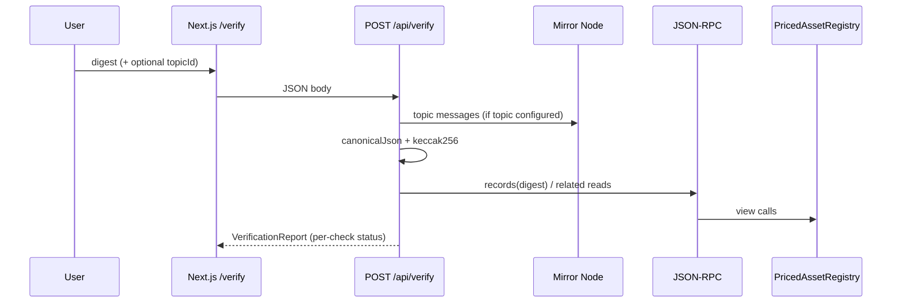

# Architecture

## Monorepo layout

```text
.
├── template.json              # create-scaffold-hbar manifest
├── .env.example
├── AGENTS.md
├── docs/                      # This documentation set
├── packages/
│   ├── shared/                # @sh/shared — types, env, digests, policy, ABI
│   ├── hardhat/               # @sh/hardhat — Solidity, scripts, tests
│   └── nextjs/                # @sh/nextjs — UI, API routes, wallets, services
└── .deploy/                   # Deploy outputs (local; do not commit secrets)
```

### `packages/shared`

Framework-free TypeScript consumed by Hardhat scripts and Next.js server code.

| Area | Path |
| --- | --- |
| Networks / endpoints | `src/constants/networks.ts` |
| Pyth deployments / feeds | `src/constants/oracle.ts` |
| Env key names / allowlists | `src/constants/registry.ts` |
| Env resolver | `src/env.ts` |
| Attestation canonical JSON + digest | `src/utils/attestation.ts` |
| Policy prediction | `src/utils/oraclePolicy.ts` |
| Generated ABI | `src/abi/generated.ts` |

### `packages/hardhat`

| Area | Path |
| --- | --- |
| Registry contract | `contracts/PricedAssetRegistry.sol` |
| Pyth interface (Hedera 4-field shape) | `contracts/interfaces/IPythOracle.sol` |
| Mock oracle for local tests | `contracts/mocks/MockPythOracle.sol` |
| Deploy | `scripts/deployRegistry.ts` |
| Account helpers | `scripts/generateAccount.ts`, `importAccount.ts` |
| Tests | `test/*.ts` |

### `packages/nextjs`

| Area | Path |
| --- | --- |
| Pages | `app/page.tsx`, `app/issue`, `app/verify`, `app/docs` |
| API | `app/api/{oracle,attest,verify,registry,config}/route.ts` |
| Server services | `services/{oracle,attestation,mirror,chains,env}.ts` |
| Wallets | `lib/reown.ts`, `lib/nativeHedera.ts`, `components/wallet/` |
| Shared UI forms | `components/IssueForm.tsx`, `VerifyForm.tsx`, `Dashboard.tsx` |

Import alias in Next.js: `~~/` → package root (see `tsconfig.json`).

## Primary verification sequence



Issuance recording on-chain (`recordIssuance`) is implemented in Solidity and exercised by Hardhat tests; the Next.js `/api/attest` route does not yet call it (see [transaction-lifecycle.md](./transaction-lifecycle.md)).

## Design decisions worth preserving

1. **Shared policy math** — `evaluateAttestation` mirrors Solidity check order so the UI can predict reverts before paying fees.
2. **Server-only secrets** — `services/env.ts` imports `server-only`; browser config goes through `/api/config` allowlist.
3. **Pyth four-word decode** — Hedera’s Pyth core returns four words, not the five-word docs shape (`packages/shared/src/constants/oracle.ts`).
4. **Digest-first attestation** — the contract stores `attestationHash`; Mirror Node supplies the payload bytes for independent check.
